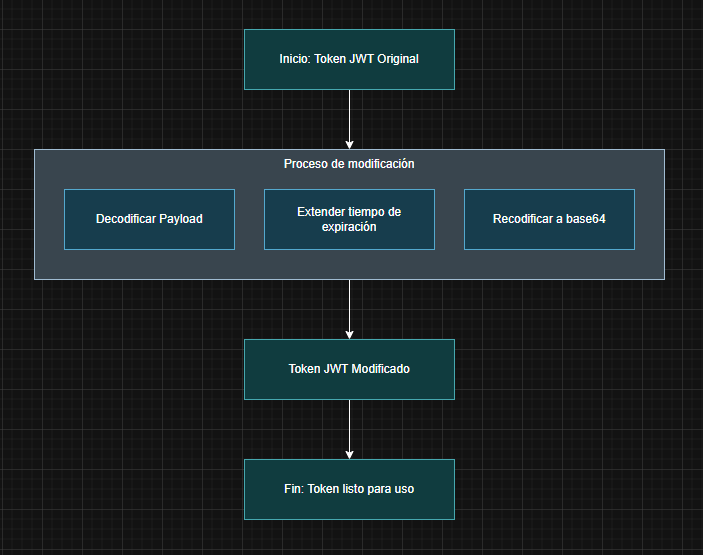

# jwt_modifier

## Descripción del proyecto

Este proyecto proporciona una herramienta en Python para manipular tokens JWT (JSON Web Tokens) sin necesidad de verificar la firma. Permite modificar campos específicos en el payload del token, en este en específico el tiempo de expiración, generando un nuevo token con una duración prolongada (24 horas) válido para su uso con fines educativos y de testing en entornos controlados. 

## Requisitos:
- Tener instalado Python
- Instalar dependencia pyjwt
  <code> pip install pyjwt </code>

## Instrucciones de uso
1. Reemplazar el valor de la variable "token" con tu token JWT real.
2. Opcionalmente, puede modificar el tiempo de expiración en segundo, variable "exp_time" el valor prederminado si no la cambia es de 24 horas.
3. Ejecutar el script
   <code>python jwt_modifier.py</code>

## Diagrama de funcionamiento

</img>

<small><b>Importante:</b> Este script solo funciona cuando el servidor destino no verifica la firma del token, caso contrario no será efectivo a menos que se posea la clave secreta para generar una firma válida.</small>